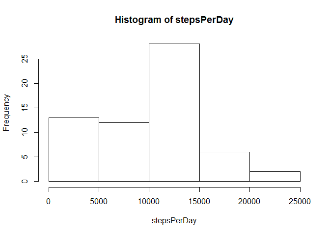
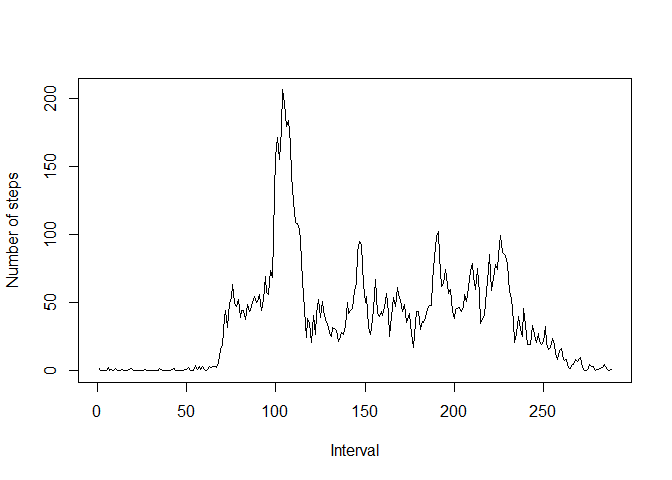
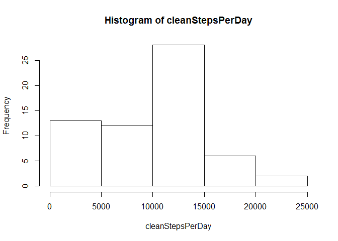

# Reproducible Research: Peer Assessment 1
## Load some libraries for later use

```r
library(stringr)
library(lattice)
```


## Loading and preprocessing the data

```r
handle <- unz("activity.zip","activity.csv")
classes <- c("integer","Date","integer")
df <- read.csv(handle, colClasses=classes)
```


## What is mean total number of steps taken per day?

```r
stepsPerDay <- sapply(split(df$steps,df$date), sum, na.rm=TRUE)
hist(stepsPerDay)
```

 

```r
mean(stepsPerDay)
```

```
## [1] 9354.23
```

```r
median(stepsPerDay)
```

```
## [1] 10395
```


## What is the average daily activity pattern?

```r
stepsByInterval <- sapply(split(df$steps,df$interval), mean, na.rm=TRUE)
plot(stepsByInterval, type='l', xlab='Interval', ylab='Number of steps')
```

 

```r
names(which.max(stepsByInterval))
```

```
## [1] "835"
```
## Imputing missing values


```r
sum(is.na(df$steps))
```

```
## [1] 2304
```

```r
filler <- function(x){
        if(is.na(x[1])){
                y <- str_trim(as.character(x[3]))
                as.numeric(stepsByInterval[[y]])
        }
        else as.numeric(x[1])
}

cleanDf <- df
cleanDf[[1]] <- apply(df,1,filler)

cleanStepsPerDay <- sapply(split(df$steps,df$date), sum, na.rm=TRUE)
hist(cleanStepsPerDay)
```

 

```r
mean(cleanStepsPerDay)
```

```
## [1] 9354.23
```

```r
median(cleanStepsPerDay)
```

```
## [1] 10395
```

## Are there differences in activity patterns between weekdays and weekends?


```r
daymapper <- function(x){
        if(weekdays(as.Date(x[2])) %in% c("Saturday","Sunday")) "weekend"
        else "weekday"
}

cleanDf$daytype <- apply(cleanDf, 1, daymapper)
cleanDf$daytype <- factor(cleanDf$daytype)


summary <- aggregate(cleanDf$steps,
                     by=list(interval=cleanDf$interval,
                             daytype=cleanDf$daytype)
                     ,mean)

xyplot(x ~ interval | daytype, data = summary, type='l'
       , layout = c(1,2), ylab = 'Number of steps')
```

 
